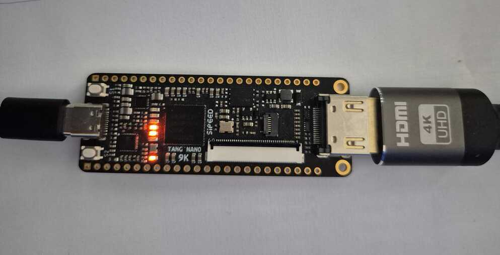
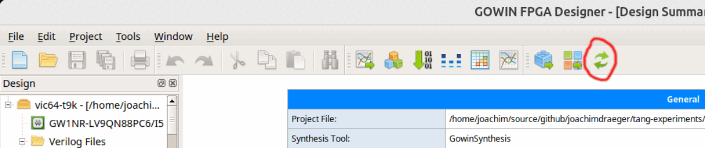
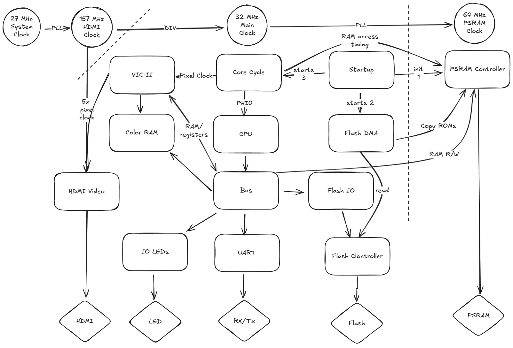
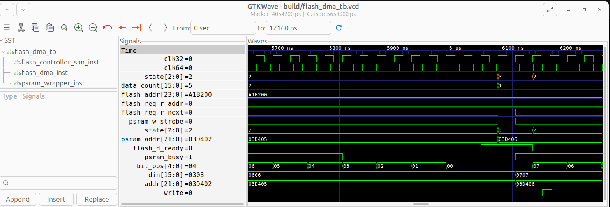

# The C64's video chip VIC-II on a Tang Nano 9k (VIC64-T9K)

The VIC64-T9K project is a proof of concept for running the [Commodore 64's](https://en.wikipedia.org/wiki/Commodore_64) [VIC-II Chip](https://en.wikipedia.org/wiki/MOS_Technology_VIC-II) together with a 6502 CPU, 64k of RAM and a serial UART on a [Tang Nano 9k](https://wiki.sipeed.com/hardware/en/tang/Tang-Nano-9K/Nano-9K.html) FPGA.
Inspiration and some of the source for this comes from the [C64_MiSTer](https://github.com/MiSTer-devel/C64_MiSTer) project which is probably the most advanced FPGA C64 implementation. My personal motivation was to learn FPGA development for my (very slow moving) retro hardware tinkering. How about pairing the Tang Nano with an actual 6502 CPU? :-) 



The Tang Nano 9k seems to be in the sweet spot of being cheap, capable enough for complex projects but not so overpowered that it could easily accommodate a complete retro computer system with all imaginable peripherals. That said, trying to squeeze more and more functionality onto it is certainly an exciting challenge but not my primary goal. I'd love to see someone pushing this further!

**Features:**

- 6502 CPU
- VIC-II Video over HDMI
- 64k of RAM using PSRAM Controller
- Color RAM (1024x4bit Block SRAM)
- UART via USB
- Custom Kernel implementing a Memory Monitor
- Kernel and Character ROM copied from Flash


## Getting Started

### Prerequisites 

- Tang Nano 9k FPGA board
- Linux system (happy to help getting it to build on Windows)
- [GOWIN Education IDE](https://www.gowinsemi.com/en/support/download_eda/)  (requires account to download)
- [openFPGALoader](https://github.com/trabucayre/openFPGALoader)
- [cc65](https://github.com/cc65/cc65) for assembling the Kernel
- [VICE](https://vice-emu.sourceforge.io/) for demo development (optional)


### Configuration

1. Copy `Makefile.config.example` to `Makefile.config` in the project's root directory
2. Set (uncomment) `GW_SH` to point to the `gw_sh` binary in the installation directory
3. Set USB_DEV to point to the USB UART device. This is usually `/dev/ttyUSB1` 
(`/dev/ttyUSB0` should be the JTAG device) 

### FPGA

The easiest way to build the FPGA bitstream is using the `pnr` make target in the fpga directory:

```bash
cd fpga
make pnr
```

Alternatively, open the GOWIN IDE and click the _Run ALL_ icon.



This should result in the bitstream located at `impl/pnr/vic64-t9k.fs`

Now you can use `openFPGALoader` using the `fpga` make target to write the bitstream to the FPGA:

```bash
make fpga
```

There might be a way to use the GOWIN IDE for this, but I didn't have success with that.

### Kernel ROM

Note that the Makefile downloads the original C64 character ROM from the [VICE Repository](https://github.com/VICE-Team/svn-mirror/).

The following will build the Kernel using the _cc65_ tool chain, combine it with the character ROM and upload it to the Tang Nano's flash chip using `openFPGALoader`:

```bash
cd ../kernel
make flash
```

Congratulations, you should now see the VIC64's startup screen via HDMI.  

### Memory Monitor

You can connect to the Memory Monitor using the minicom terminal with the `com` make target in either the `fpga/` or `kernel/` folder:

`make com`

These are the available commands:

|Command | Description | Example |
|--------|-------------|---------|
|`R <ADDR>`| Displays a byte at the hex address. <br> Add `.` for a line or `..` for a page.| `R C000 ..` |
|`.`|Outputs another line of bytes from the<br> current address | `.` |
|`..`|Outputs another line of bytes from the<br> current address | `..` |
|`W <ADDR> <B1> <B2>`| Writes hex bytes to the given hex address|`W C000 A1 A2 A3`| 
|`:<C1> <B2>` | Writes hex bytes to the current address | `:C4 5D` | 
|`S <n>`| Turns the screen output on(`1`)/off(`0`)<br>off: enables 80 columns in terminal | `S 0` |
|`E <n>` | Turns echo on(`1`)/off(`0`) | `E 1`|  
|`J <ADDR>` | Jumps to the hex address | `J C030` |

Note:
- The input buffer has 80 characters. Backspace is not supported. 
- Any read or write advances the address counter

The following example changes cursor, border and background colors. The addresses are the same as on the C64:
```
>W 0286 05
>.. 
>W D020 0B 00
>R D020 .
>W D020 00
```

## Demos

### Koala bitmap display


The bitmap display demo is a script that uploads a file in [Koala format](https://en.wikipedia.org/wiki/KoalaPad#File_format) to the VIC64. The format is actually very simple:
- 2 byte load address
- 8000 bytes of bitmap data
- 1000 bytes of screen
- 1000 bytes of color
- 1 byte background color 

However, finding files in this format was more difficult than expected. I have tried the files from this URL: https://sembiance.com/fileFormatSamples/image/koalaPaint/ although I don't know anything else about the source. Please let me know if you have any alternatives.

Usage:

```bash
cd demo/bitmap
./load_image.sh <path/to/bitmap.koa>
```

The script first splits the file into its parts. Then it uses a python program `uploader.py` which interfaces with the memory monitor via the UART. 

Note that the upload speed hasn't been optimised and the image will appear quite slowly. The GIF above is playing faster.

### Sprite


This demo creates a sprite and moves it around the screen. It's written in `ca65` assembler and can be transferred and run using `uploader.py`.

To run the demo on the VIC64:

```bash
cd demo/sprite
make run
```

The demo runs in a loop and doesn't return to the Memory Monitor. The `uploader.py` will throw an `_queue.Empty` exception because it expects the prompt.

#### VICE Cartridge

There's also a mode to run as a cartridge in the VICE emulator. You need to have VICE installed and the C64 ROMS downloaded e.g. from the [VICE-Team Github](https://github.com/VICE-Team/svn-mirror/tree/main/vice/data/C64). The Makefile expects the ROMs to be present in `~/.vice/C64` or the `VICE_ROM_PATH` to be set accordingly. 

```bash
cd demo/sprite
make vice
```

Getting the cartridge format right was a bit more obscure than I thought. I started trawling VICE bug reports about cartridge auto start until I finally got to the right spec. The cartridge needs, apart from a couple of initialisation vectors, a magic signature of "CBM80" _in reverse PETSCII_ at byte 5. Obviously.

#### Code

The code in `demo/sprite/src` has two entry points based whether it runs on the device or as a cartridge in VICE:

- `cart.s` contains the initialisation vectors, the magic signature and a bit of C64 initialisation code. The memory map is in `cart.cfg`
- `vic64.s` just consists of a single `JMP` instruction. Also `vic64.cfg` is simpler.
- `main.s` contains the sprite as a byte sequence and the code to display and move it on the screen using a sine table and delay loops.

## FPGA Implementation



The overview diagram shows the generation of the clocks at the top. The main components are in the center. The arrows indicate logical control, utilisation or access. The bottom elements represent physical IO devices.

All main modules are instantiated in the [`top.v`](fpga/src/top.v) module. The top module is intentionally kept free of logic. 

### Clocks

The HDMI video interface requires a 31.4 MHz pixel clock for the 800 x 576 resolution at 50 Hz PAL output. This clock is also used as the main ~32 MHz main clock. Additionally, HDMI requires a faster clock at 5x the pixel clock. To achieve that an PLL (Phase-Locked Loop) is used to generate 157 MHz 5x from the FPGA's 27 MHz system clock this is then divided by 5 for the 31.4 MHz pixel clock.

The [PSRAM controller's](https://github.com/zf3/psram-tang-nano-9k) clock needs to be fast enough to allow timed RAM access for the CPU and VIC-II chip. Additionally a 90 degree phase shifted clock is required for the controller. Another PLL is used to double the ~32 MHz main clock to ~64 MHz plus phase shifted. The clock domains should be separated properly, so the PSRAM clock could potentially be generated from the 27 MHz system clock.

All clocks are instantiated in the [`clocks.v`](fpga/src/clocks.v) module.

### Startup

When the FPGA starts or the S1 button (reset) is pressed most modules are kept in reset until the startup procedure, which is controlled by [`startup.v`](fpga/src/main/startup.v), is completed:

1. Initialise PSRAM
2. Copy ROMs to PSRAM using [`flash_dma.v`](fpga/src/main/flash_dma.v)
3. Blink LED 
4. Set `startup_resetn` to 1

Note that the reset button isn't 100% reliable and probably needs more timing improvements.

### Core Cycle

Timings for the CPU, VIC-II, IO and PSRAM are generated by [`core_cycle.v`](fpga/src/main/core_cycle.v). The logic is driven by a `0-31` counter on every rising edge of the 32 MHz system clock. `phi`, the 1 MHz clock that drives the CPU (and on the falling edge, the VIC-II), rises on cycle `15` and falls on `31`. PSRAM access, for example, is triggered right after these on cycle `17` and `1`. This timing originates from the _C64_MiSTer_ core and its predecessor, _fpga64_.

### Bus

The responsibility of the [`bus.v`](fpga/src/main/bus.v) module is to coordinate data flow between the CPU, VIC-II and IO devices. This includes mapping of addresses to devices (for example, the UART is at `$DE00`) and connecting the right wires to the CPU input. 

### HDMI Video

The VIC-II ([`video_vicII_656x.vhd`](fpga/src/lib/vicii/video_vicII_656x.vhd)) outputs PAL with 16 colors. These get converted to RGB by [`fpga64_rgbcolor.vhd`](fpga/src/lib/vicii/fpga64_rgbcolor.vhd).

The [`video.v`](fpga/src/lib/video/video.v) module takes the PAL / RGB color output and scales it up to a suitable resolution for HDMI. It also has logic to detect the start of the frame. Usually the [HDMI 1.4b video/audio FPGA](https://github.com/hdl-util/hdmi) library would require to time the frame generation following the HDMI output. 

The video module originates from the _C64_MiSTer_ project and has been adapted for the Tang Nano 20k, at first for an Atari ST core: [MiSTeryNano](https://github.com/harbaum/MiSTeryNano). This also includes adaptation of the HDMI library. The current version is included from the [C64Nano](https://github.com/vossstef/tang_nano_20k_c64) project which only required minor changes to work on the Tang Nano 9k. The code for an On Screen Display has been removed. This project also doesn't make use of the audio output because the SID sound chip is not included.

### C64Nano Comparison

The C64Nano project implements the C64_MiSTer on a Tang Nano 20k which is still very affordable and probably a better target for a complete system. For example, the Tang Nano 20k has plenty of SDRAM which is faster and easier to interface with than the PSRAM of the 9k. 

**Tang Nano 9K vs 20K comparison:**

| Specification | Tang Nano 9K | Tang Nano 20K |
|---------------|---------------|---------------|
| **FPGA Chip** | Gowin GW1NR-9 | Gowin GW2AR-18 QN88 |
| **LUTs** | 8,640 LUT4 | 20,736 LUT4 |
| **External RAM** | 8 MB PSRAM | 8 MB **SDRAM** (32-bit width) |
| **Block RAM** | 58.5 KB (468 Kbit) | 103.5 KB (828 Kbit) |
| **Shadow SRAM** | 2 KB (16 Kbit) | 5.18 KB (41.47 Kbit) |
| **Flash Storage** | 4 MB SPI | 8 MB QSPI NOR |
| **DSP Multipliers** | 20 (18×18) | 48 (18×18) |
| **PLLs** | 2 | 2 |

### Verilog Test Bench

This project has a mixed Verilog and VHDL code base which can make it challenging to set up test benches. The only free mixed language tool available seems to be [ModelSim-Intel](https://www.intel.com/content/www/us/en/software-kit/750666/modelsim-intel-fpgas-standard-edition-software-version-20-1-1.html). However, it is quite GUI heavy and can be cumbersome to use.

The main language for this repo is Verilog. [ICARUS Verilog](https://github.com/steveicarus/iverilog) together with [GTKWave](https://gtkwave.sourceforge.net/) are much more lightweight and easier to get started with.

The following test benches have `make` targets which execute the respective test bench and launch GTKWave to inspect the result. There are no assertions implemented.

**UART**

[`uart_tb.v`](fpga/test/v/tb/uart_tb.v) sends and receives a few bytes by connecting rx to tx. Note that `d_in`/`d_out` only holds the valid data for a clock cycle. So that needs some zooming in to see. 

```bash
cd fpga
make uart-wave
```

**Flash / PSRAM DMA**



[`flash_dma_tb.v`](fpga/test/v/tb/flash_dma_tb.v) tests the transfer of ROM data from the flash memory to PSRAM which gets executed during the startup sequence. The random access latency of the flash chip would be too high to use it as ROM directly. 

The simulation contains stubs for flash and PSRAM: [`flash_controller_sim.v`](fpga/test/v/sim/flash_controller_sim.v), [`psram_stub.v`](fpga/test/v/sim/psram_stub.v) The test introduces some skew between the 32 and 64 MHz clock to test the clock domain crossing logic.

```bash
cd fpga
make dma-wave
```

## Kernel Development

The Kernel implements the following:

* Text mode initialisation
* Screen output, including scrolling
* Memory Monitor via UART and screen display

Some of the zero page and other significant addresses have been aligned with the C64.

### Launching the Kernel

There are three ways to run the Kernel:

* `make sim65` runs the memory monitor using the _sim65_ emulator which is included in the _cc65_ suite. 
* `make testing` uses the [`uploader.py`](uploader/uploader.py) script to upload a new version to a different memory address. This of course requires that a fully working version is currently loaded.
* `make flash` uploads the kernel together with the character rom to the FPGA's flash memory. This then gets automatically loaded into PSRAM during startup.

### upload.py

This is a Python script which can use the memory monitor to read/write memory on the VIC64 via the serial console.

```bash
cd uploader
python3 uploader.py --help
usage: uploader.py [-h] [--port PORT] [--file FILE] --address ADDRESS [--skip-upload] [--skip-validate] [--jump-before JUMP_BEFORE]
                   [--jump-after JUMP_AFTER] [--read READ] [--write WRITE] [--screen-off] [--debug]

Serial uploader for the VIC64-T9K memory monitor

options:
  -h, --help            show this help message and exit
  --port PORT           Serial port to use (default: /dev/ttyUSB1)
  --file FILE           File to upload
  --address ADDRESS     Address to upload to
  --skip-upload         Skip the upload step
  --skip-validate       Skip validation after upload
  --jump-before JUMP_BEFORE
  --jump-after JUMP_AFTER
  --read READ           Number of bytes to read from memory
  --write WRITE         hex bytes to write
  --screen-off          Keep screen output off
  --debug               Enable debug mode
  ```
  
## License and Credits

This project is licensed under the GPL v3 license. See the included [LICENSE](LICENSE) file. 

- Core files around the VIC, video and CPU come from the https://github.com/MiSTer-devel/C64_MiSTer project which is GPL licensed. 
- Origins of the VIC-II implementation go back to https://www.syntiac.com/fpga64.html
- SystemVerilog code for HDMI 1.4b video/audio output on an FPGA.
https://github.com/hdl-util/hdmi 
- The video module from the _C64_MiSTer_  has been adapted for the Tang Nano 20k, at first for an Atari ST core: https://github.com/harbaum/MiSTeryNano. This also includes adaptation of the HDMI library. 
- The current version is included from the https://github.com/vossstef/tang_nano_20k_c64 project which only required minor changes to work on the Tang Nano 9k. 
- PSRAM/HyperRAM controller for Tang Nano 9K:
https://github.com/zf3/psram-tang-nano-9k

These Open Source projects provided great inspiration and learnings. ❤️


## Contact

- Feel free do raise an Issue or PR for bug fixes or improvements.
- Do you have any question about the project? Or would you like to share something about Retro Computing on FPGAs? [Discussions](
https://github.com/joachimdraeger/vic64-t9k/discussions/categories/general)


